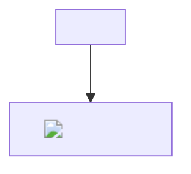
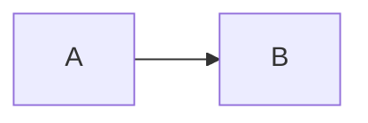

# Hostile Mermaid

```mermaid
graph TD
  A["<script>alert(1)</script>"] --> B["<img src=x onerror=alert(2)>"]
  click A "javascript:alert(3)"
```

```mermaid
%%{init: {"securityLevel": "loose"}}%%
graph LR
  A --> B
```
